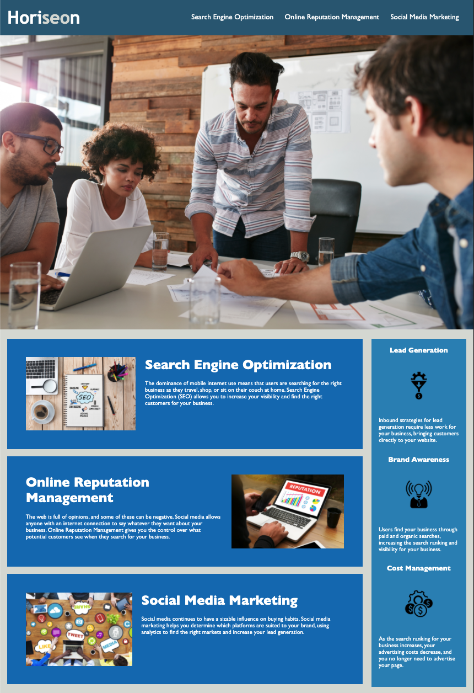

# <HORISEON LANGING PAGE>

## Description

Horiseon, a marketing agency, came to us with the task of increasing the accessibility of their site. We can achieve this by improving their existing codebase to ensure long-term sustainability. This was primarily done by; consolidating the selectors and properties of the existing CSS, ensuring the navigation bar links are functioning correctly, organising the HTML elements into a semantic structure and including comments  where required to assist in future code development.

The motivation for this, which has become an increasingly important consideration for businesses, is web accessibility. This works two fold. Firstly, it is important as it ensures that people with disabilities can access the website using assistive technologies. Secondly, it can help the website rank higher in search engines like Google. 

Here I learnt an important lesson, that you should adhere to the Scout Rule-always leave the code a little cleaner than when you found it. 

Furthermore, I learned to eliminate excess lines of code while refactoring. 

## Horiseon Landing Page



# User Story

```
AS A marketing agency
I WANT a codebase that follows accessibility standards
SO THAT our own site is optimized for search engines
```

## Acceptance Criteria

```
GIVEN a webpage meets accessibility standards
WHEN I view the source code
THEN I find semantic HTML elements
WHEN I view the structure of the HTML elements
THEN I find that the elements follow a logical structure independent of styling and positioning
WHEN I view the image elements
THEN I find accessible alt attributes
WHEN I view the heading attributes
THEN they fall in sequential order
WHEN I view the title element
THEN I find a concise, descriptive title
```

## Grading Requirements

This homework is graded based on the following criteria: 

### Technical Acceptance Criteria: 40%

* Satisfies all of the preceding acceptance criteria plus the following code improvements:

  * Application's links all function correctly.

  * Application's CSS selectors and properties are consolidated and organized to follow semantic structure.

  * Application's CSS file is properly commented.

### Deployment: 32%

* Application deployed at live URL.

* Application loads with no errors.

* Application GitHub URL submitted.

* GitHub repository contains application code.

### Application Quality: 15%

* Application resembles mock-up provided in the homework instructions (at least 90%).

### Repository Quality: 13%

* Repository has a unique name.

* Repository follows best practices for file structure and naming conventions.

* Repository follows best practices for class/id naming conventions, indentation, quality comments, etc.

* Repository contains multiple descriptive commit messages.

* Repository contains quality README file with description, screenshot, and link to deployed application.

## Review

You are required to submit the following for review:

* The URL of the deployed application.

* The URL of the GitHub repository, with a unique name and a README that describes the project.

